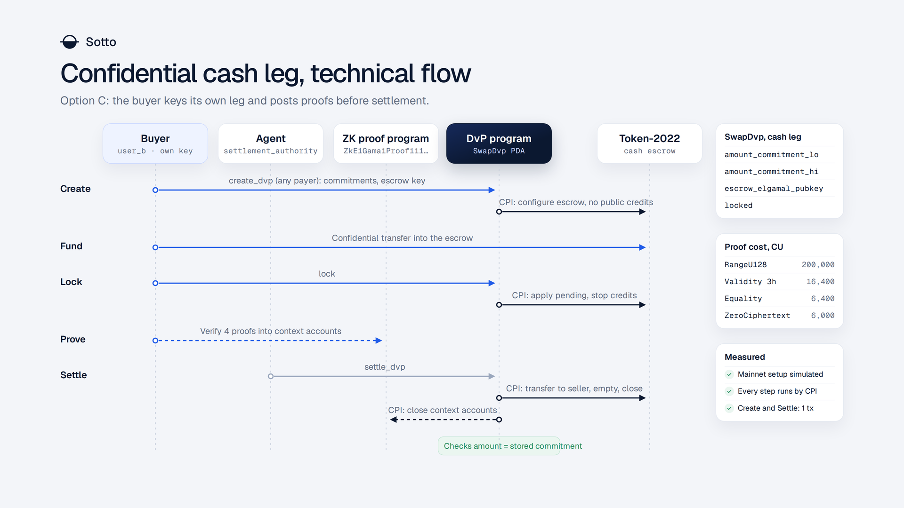
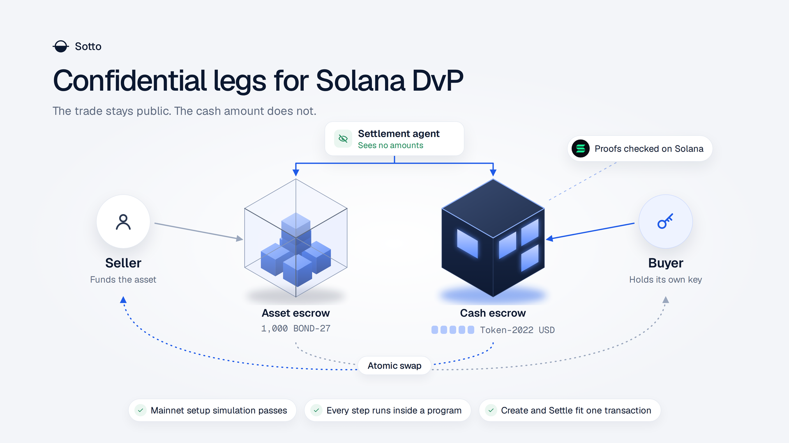

# Confidential legs for Solana DvP

A design proposal for the maintainers of `solana-foundation/dvp`.

| | |
|---|---|
| Status | Draft for discussion. The DvP mode is not built; the mechanics it relies on were tested in a throwaway spike. |
| Authors | Cayvox Labs · cayvox.com · info@cayvox.com |
| Date | 2026-10-07 |
| DvP code studied | `solana-foundation/dvp` at commit `df9919ed02c25a93620e7f6820107c9050ce3b92` (2026-09-30) |
| Method | Source reading, plus a verification spike run on 2026-10-06 and 2026-10-07: read and simulate only on mainnet, a throwaway program on a local validator, and a LiteSVM test. Its code, logs and tool versions are in `spike/`. We did not build, run or test the DvP program itself. |

## 0. Summary

DvP settles two public token legs atomically. Both amounts are public three times over: in the `SwapDvp` account, in the funding transfers and in the settlement transfers. This document asks what it would take for one or both legs to move as Token-2022 confidential transfers, so that the amounts stay encrypted onchain while the parties, the mints and the timing stay public.

Four findings, in order of importance:

1. **The escrow key is not a custody key.** In Token-2022 the authority that may move a confidential balance (the account owner, here the `SwapDvp` PDA) and the ElGamal key that can read the balance and build the proofs are two separate things. The PDA can stay the only signer. Whoever holds the ElGamal secret can read and can prove, and can do nothing else. So "who holds the escrow key" decides confidentiality and liveness. It never decides who can take the funds.
2. **Safety can stay in the program.** If the program fixes the destinations (as it does today), binds the delivered amount to a commitment stored at Create, and closes the escrow in the same instruction, then Token-2022 itself rejects every outcome except "the agreed amount went to the counterparty and the rest went back to the depositor". A prover can withhold a proof. It cannot redirect or keep anything.
3. **Every exit needs a proof.** Today `Reject`, `Reclaim` and `Recover` need one signature. With a confidential leg, draining the escrow needs zero knowledge proofs made by someone who holds the escrow's ElGamal secret. This is the real design problem, and the three options below are three answers to it.
4. **One program can serve all three options.** The program never needs to know who holds the secret. It takes an ElGamal public key per confidential leg at Create and proof accounts at every instruction that moves that leg. The options differ in who generates the key and when the proofs are posted, which is client protocol, not program logic.

The options: (A) the settlement agent holds the escrow key and proves, (B) one key per trade shared by both parties and the agent, (C) each depositor keeps the key of its own leg and posts the proofs in advance, so the agent settles without seeing any amount.

A verification spike on 2026-10-06 checked the mechanics this rests on (section 7.2):

- The Token-2022 program on mainnet is the verified build of `program@v11.0.0` and accepts confidential transfer instructions in simulation.
- A program whose PDA owns a Token-2022 account can do every step by CPI: configure the account, apply the pending balance, shut credits, transfer with proofs from context accounts or from the same transaction, empty, close, and close the proof accounts it is the authority of.
- A Create and a Settle for one confidential leg each fit one version 0 transaction (553 and 729 bytes, about 37,000 and 29,000 compute units in the spike's program). Two confidential legs in one Settle are at the edge of version 0. The range proof of a transfer needs a version 1 transaction or a proof stored in an account.
- LiteSVM 0.7.0, which DvP's tests use, runs the proof program. Its bundled Token-2022 lacks the zk operations, and the mainnet binary loads in its place.

Section 6 says what we would prototype next and lists the questions we need the maintainers to answer before writing more code.

The overview and this flow as a two page PDF: [docs/confidential-dvp.pdf](docs/confidential-dvp.pdf).

### Sources and how they are cited

- **DvP**: paths are relative to the repository root at the commit above, with line numbers.
- **T22**: the `spl-token-2022` crate, version 9.0.0, the version the DvP workspace pins (`Cargo.toml` line 29) and its lockfile resolves for the program. Paths are relative to the crate's `src/`. Two of its files are cited often and share a name, so they get short names: **CT** is `extension/confidential_transfer/processor.rs` and **T22 main** is `processor.rs`.
- **PX**: the `spl-token-confidential-transfer-proof-extraction` crate. We read version 0.4.0. The DvP lockfile resolves 0.4.1, which we did not have locally, so line numbers may be off by a few lines.
- **ZKP**: the `solana-zk-elgamal-proof-program` crate, version 4.3.0, file `src/lib.rs` (the Agave native program).
- **Sotto measurement**: something we ran ourselves on localnet or devnet while building Sotto, with the tool versions stated. These are not measurements of DvP.
- **Spike**: the verification spike of 2026-10-06 and 2026-10-07, written for this document. Section 7.2 gives its results and `spike/README.md` its files, commands and tool versions. It measures Token-2022 and the proof program under a throwaway program. It does not measure DvP.

Mainnet does not run 9.0.0. It runs the verified build of `program@v11.0.0` (7.2.1). We compared the confidential transfer processor of the two versions (7.2.7): the rules this document relies on are the same in both, and the line numbers cited here stay those of 9.0.0.

Anything we could not confirm from source or from our own runs is marked **Unknown**. After the spike one such mark is left, in 7.2.8.

## 1. How DvP works today

### 1.1 State and roles

`SwapDvp` is one PDA per trade (DvP `program/src/state/swap_dvp.rs` lines 29 to 72). It stores the two parties, the two mints, the settlement authority, the token program of each mint, `amount_a` and `amount_b` as plain `u64` (lines 42 and 43), `expiry_timestamp`, `nonce`, a 64 byte `ref_string`, the two settlement destinations, the mint authorities captured at Create, and the optional `earliest_settlement_timestamp`. Seeds: `["dvp", settlement_authority, user_a, user_b, mint_a, mint_b, nonce]` (lines 90 to 105). The amounts and deadlines are not part of the seeds (README line 98).

Three roles:

- `user_a`, the seller, delivers `amount_a` of `mint_a` (the asset leg).
- `user_b`, the buyer, delivers `amount_b` of `mint_b` (the cash leg).
- `settlement_authority`, the settlement agent, is the only signer that can settle (`settle_dvp.rs` lines 90 and 98 to 101) or cancel (`cancel_dvp.rs` lines 63 and 72 to 75). It must not be a party (`create_dvp.rs` lines 458 to 461) and must not be executable (lines 94 to 97).

The agent decides whether and when a trade settles. It cannot change where funds go: destinations are resolved and stored at Create (`create_dvp.rs` lines 142 to 152) and Settle never branches on them.

### 1.2 Create

`CreateDvp` is permissionless: only the payer signs (`create_dvp.rs` line 85). It validates the mints against a deny list (lines 107 and 108, see 1.7), validates the arguments (lines 434 to 468), creates the `SwapDvp` PDA (lines 217 to 224), a nonce tombstone PDA that is never closed (lines 228 to 241), and both escrow accounts (lines 243 to 261).

The escrows are the canonical associated token accounts of the `SwapDvp` PDA for each mint (lines 172 to 184). The PDA is their owner, so only the program can move what they hold.

Because nobody but the payer signs, a `SwapDvp` record is not proof of agreement. Funders must read the stored terms and compare them with the deal before depositing, and the agent must validate again before settling (README lines 98 to 100).

### 1.3 Funding

There is no funding instruction. The program has six instructions (`discriminator.rs` lines 3 to 10): Create, Reclaim, Settle, Cancel, Reject, Recover. Each side funds its leg by sending tokens to the leg's escrow with an ordinary `TransferChecked` (README lines 17 and 81). The stated reason is that custodian integrations then need no custom program call.

Consequences the program already handles:

- Anyone can send tokens to an escrow, so an escrow may hold more than its leg amount. Settle delivers exactly the leg amount and refunds the surplus to the depositor (README line 84).
- A funding transfer never reads the `SwapDvp`, so it can land after the trade closed. `RecoverDvp` exists for that case (README line 89).

### 1.4 Settle

`SettleDvp` (`settle_dvp.rs`), signed by the settlement authority:

1. Binds mints and token programs to state and checks each mint again: owner, deny listed extensions, mint authority (lines 104 to 140).
2. Checks the deadlines against cluster time: `now <= expiry_timestamp`, and `now >= earliest_settlement_timestamp` when set (lines 142 to 146).
3. Checks that all six token accounts are canonical and that the recipients still belong to the expected wallets (lines 155 to 216).
4. **Reads both escrow balances and requires each to be at least its leg amount** (lines 222 to 231). The read is `get_token_account_balance` (`shared/token_utils.rs` lines 227 to 241), which returns the public `amount` field of the token account.
5. Moves the cash leg to the seller's destination and the asset leg to the buyer's destination with `TransferChecked` CPIs signed by the PDA (lines 242 to 266). The amount is an explicit `u64` in the CPI data (`shared/token_utils.rs` lines 459 to 462).
6. Refunds any surplus to each depositor (lines 278 to 308).
7. Closes both escrows and the `SwapDvp` account, rent to the settlement authority (lines 311 to 337).

### 1.5 Cancel, Reject, Reclaim, Recover

- `CancelDvp` (settlement authority) and `RejectDvp` (either party, `reject_dvp.rs` lines 74 to 77) share one path, `refund_and_close_dvp` (`shared/refund.rs` lines 27 to 155). It reads both escrow balances (lines 96 and 97), transfers each funded leg back to its depositor (lines 99 to 127), closes both escrows and the PDA (lines 129 to 152).
- `ReclaimDvp` lets a party drain its own leg at any time and leaves the trade open (`reclaim_dvp.rs` lines 80 to 86 and 126 to 145).
- `RecoverDvp` drains an escrow that was recreated after the trade closed, authenticated by the tombstone (`recover_dvp.rs` lines 137 to 155 and 200 to 225).

Two properties matter for what follows:

- **Exits never depend on the agent.** Reject is described as the safety valve that "must work even if the configured settlement authority is unreachable" (`reject_dvp.rs` lines 22 to 27).
- **Exits never depend on the mint staying well behaved.** The unwind paths skip the extension checks so that funds are never stranded (`shared/refund.rs` lines 20 to 22, `reclaim_dvp.rs` lines 37 to 40).

### 1.6 Deadlines

Only Settle is gated by time (`settle_dvp.rs` lines 142 to 146). Cancel, Reject and Reclaim have no expiry check (`cancel_dvp.rs` lines 19 and 20, `reclaim_dvp.rs` lines 98 and 99). Create requires `expiry > now`, caps it at one year (`create_dvp.rs` lines 28 and 443 to 450) and requires `earliest <= expiry` (lines 451 to 456). Time is `Clock::unix_timestamp` (README line 94).

### 1.7 Token-2022 extension support

Each leg carries its own token program, so legs can mix SPL Token and Token-2022 (README line 101). `validate_mint_extensions` (`shared/token_utils.rs` lines 323 to 348) rejects `TransferFee`, `InterestBearing`, `ScaledUiAmount` and `NonTransferable` at Create and again at Settle. Everything else is accepted, with the trust this implies spelled out in the comment above the function (lines 278 to 321). Transfer hooks are supported by forwarding trailing accounts, at most 32 per leg (`shared/token_utils.rs` line 364, `shared/utils.rs` lines 34 to 64). Destinations that require a memo are supported (`shared/token_utils.rs` lines 369 to 395).

On confidential transfers, the comment above `validate_mint_extensions` says this (`shared/token_utils.rs` lines 291 to 295, also README line 101; quoted with its dashes replaced by commas):

> `ConfidentialTransfer` on the mint doesn't force confidential transfers, the public `TransferChecked` path keeps exact amounts, and the escrow can never receive a confidential deposit because configuring its `ConfidentialTransferAccount` extension would need the SwapDvp PDA to sign `ConfigureAccount`.

The test `test_settle_with_confidential_transfer_on_mint_a` (`tests/integration-tests/src/test_token_2022/mod.rs` lines 153 to 181) pins exactly that: a mint with the extension runs the normal public lifecycle.

So the current position is deliberate: mints with the extension are welcome, and confidential movement is excluded by construction. This proposal is about lifting that exclusion as an opt in, not about a bug.

## 2. Why Token-2022 confidential transfers cannot be used as is

### 2.1 The escrow cannot receive a confidential transfer

A token account can receive a confidential transfer only if it carries a configured and approved `ConfidentialTransferAccount` extension that allows confidential credits (CT lines 924 to 926, T22 `extension/confidential_transfer/mod.rs` lines 173 to 191).

`ConfigureAccount` needs two things (CT lines 201 to 295):

- A `PubkeyValidity` proof for the ElGamal public key being installed (lines 212 to 220).
- The signature of the token account owner (lines 236 to 247).

The owner of the escrow is the `SwapDvp` PDA, and DvP has no instruction that signs `ConfigureAccount`. The variant `ConfigureAccountWithRegistry` skips the owner signature but needs an ElGamal registry account whose owner field equals the token account owner (lines 248 to 255). That is no shortcut for a PDA: creating the registry account itself needs the wallet's signature (`spl-elgamal-registry` 0.3.0, `src/processor.rs` lines 31 to 36), so a program instruction that signs for the PDA is needed either way. We did not check whether the registry program is deployed on mainnet.

The associated token account is also created without room for the extension (it is not in the list of extensions a mint forces on new accounts, T22 `extension/mod.rs` lines 1297 to 1319), so a `Reallocate` signed by the owner is needed first (T22 `extension/reallocate.rs` line 39).

### 2.2 The program reads and moves public amounts only

- The funded check reads the public `amount` (DvP `shared/token_utils.rs` lines 227 to 241). A confidentially funded escrow has a public amount of zero, so Settle fails with `LegNotFunded` (DvP `settle_dvp.rs` lines 222 to 231).
- Every movement is a `TransferChecked` with a plain `u64` (DvP `shared/token_utils.rs` lines 414 to 488). It moves the public balance and nothing else.
- The agreed amounts are public in the `SwapDvp` account (DvP `state/swap_dvp.rs` lines 42 and 43) and in the Create instruction data (DvP `create_dvp.rs` lines 289 to 294). Encrypting the transfers while leaving these fields would hide nothing.

### 2.3 Who holds the escrow's ElGamal key

A confidential transfer out of an account needs three proofs (T22 `extension/confidential_transfer/verify_proof.rs` lines 59 to 110):

1. `CiphertextCommitmentEquality`: the new source balance ciphertext and a Pedersen commitment hide the same value. Building it needs the **source ElGamal secret key**.
2. `BatchedGroupedCiphertext3HandlesValidity`: the transfer amount is encrypted consistently to the source, the destination and the mint's auditor.
3. `BatchedRangeProofU128`: the remaining balance fits in 64 bits (so it is not negative) and the amount parts fit in 16 and 32 bits (PX `transfer.rs` lines 105 to 108). Building it needs the **plaintext remaining balance**.

A program has no secrets. The PDA can sign, but it cannot produce any of these. So some offchain party must hold the ElGamal secret of each confidential escrow and must know its balance. Today no such party exists, and nothing in the `SwapDvp` state names one.

The reassuring half of this: Token-2022 checks the transfer authority and the proofs separately. The authority must be the account owner (CT lines 846 to 852, through `Processor::validate_owner`, T22 main lines 1937 to 1973). The same owner check guards `ApplyPendingBalance`, `EmptyAccount` and the credit toggles (lines 354 to 360, and the functions starting at lines 1152, 1202 and 1233). The ElGamal secret alone authorizes nothing. This is finding 1 of the summary.

### 2.4 Who generates the proofs at Settle and at Cancel

Token-2022 binds the proofs to the live account state:

- The source public key in the proof must equal the account's `elgamal_pubkey` (CT lines 868 to 870).
- The new balance ciphertext in the proof must equal the current `available_balance` minus the transfer ciphertexts, computed onchain (lines 881 to 892).
- The destination public key in the proof must equal the destination account's key (lines 928 to 932), and the auditor key must equal the mint's (lines 659 to 666).

So proofs are specific to one source balance, one destination and one amount. They can be made any time after the escrow balance is final, and they stay valid exactly as long as the `available_balance` ciphertext does not change.

At Settle someone must supply, per confidential leg, the three delivery proofs. At Cancel, Reject, Reclaim and Recover someone must supply the three proofs for the refund. Both cases need one more proof, see 2.5. In all cases that someone needs the escrow's ElGamal secret. Today Reject and Reclaim are callable by a party alone and Cancel by the agent alone. With a confidential leg, "alone" is only true for whoever holds the key.

### 2.5 Closing a confidential escrow needs another proof

`CloseAccount` refuses a token account whose confidential extension is not empty (T22 main lines 1237 to 1241). Empty means the pending and available balance ciphertexts are the all zero bytes (T22 `extension/confidential_transfer/mod.rs` lines 139 to 148).

After the last transfer out, the available balance is an encryption of zero but not the all zero ciphertext. `EmptyAccount` resets it, and requires a `ZeroCiphertext` proof for the current ciphertext plus the owner's signature (CT lines 332 to 382). That proof also needs the ElGamal secret.

Two consequences:

- Every terminal path needs four proofs per confidential leg (three for the transfer, one to empty), seven if a surplus must also be returned.
- Incoming confidential credits land in the **pending** balance (CT lines 943 to 955) and only the owner can apply them (function at line 1152). A third party can therefore put a non zero pending balance on an escrow at any time, and `CloseAccount` then fails. In the public design dust is refunded and the close goes through. In a confidential design the escrow must stop accepting credits before the terminal proofs are made. `DisableConfidentialCredits` does this (function at line 1202).

### 2.6 What the ZK ElGamal Proof program requires

- Proofs are verified by the native program `ZkE1Gama1Proof11111111111111111111111111111`, either by an instruction in the same transaction, which Token-2022 finds through the instructions sysvar, or in advance into a **context state account**, which Token-2022 then reads (PX `instruction.rs` lines 72 to 104).
- A context state account must be created beforehand, owned by the proof program, with the exact size of its context type (ZKP lines 105 to 126). The key named as its authority does not sign at creation (lines 101 to 103) and must sign to close it (lines 132 to 164).
- When Token-2022 consumes a context state account it checks the owner and the proof type and nothing else (PX `instruction.rs` lines 77 to 88). It does not check the context authority. **Anyone can post a proof for anyone's transfer.** Only the content of the proof matters. Option C relies on this.
- Compute cost of verification, charged up front (ZKP lines 20 to 32): range proof U128 200,000 units, range proof U64 111,000, batched three handle validity 16,400, ciphertext and commitment equality 6,400, zero ciphertext 6,000, public key validity 2,600. Compute is not the binding limit, transaction size is. Spike measurement (7.2.5): a confidential transfer by CPI with its three proofs in the same transaction is about 2,500 bytes, which fits a version 1 transaction (limit 4,096) and not a version 0 one (limit 1,232). The range proof alone does not fit a version 0 transaction either. So the realistic shape is: verify into context accounts in earlier transactions, then settle by reference. A Settle that only reads context accounts is small (729 bytes and about 29,000 compute units for one leg).
- The program has a kill switch. Every instruction fails while the feature gate `disable_zk_elgamal_proof_program` is active and `reenable_zk_elgamal_proof_program` is not (ZKP lines 175 to 188). The gate was used: the program was disabled on mainnet in June 2025 (https://solana.com/news/post-mortem-june-25-2025). Sotto measurement, 2026-09-26: on mainnet the reenable gate shows as activated at slot 424224000, block time 2026-06-04.

### 2.7 Other constraints from Token-2022

- **48 bit amounts.** One confidential transfer or deposit carries at most `2^48 - 1` base units (T22 `extension/confidential_transfer/mod.rs` lines 18 to 21). With 6 decimals that is about 281 million units, with 9 decimals about 281 thousand. Larger legs need several transfers.
- **The mint must opt in.** The transfer fails without `ConfidentialTransferMint` on the mint (CT line 631). SPL Token mints have no such extension.
- **Approval.** If the mint does not approve new accounts automatically, each escrow must be approved by the mint's confidential transfer authority before it can receive (CT lines 269 and 298 to 329).
- **Mint auditor.** If the mint has an auditor key, every transfer must carry the amount encrypted to it (CT lines 659 to 682). See section 5.
- **No wrapped SOL.** Confidential deposit and withdraw assert the account is not native (CT lines 443 and 563).
- **Transfer hooks see no amount.** A confidential transfer calls the hook with `u64::MAX` as the amount (CT lines 804 to 814). DvP's forwarding of hook accounts would carry over, but a hook that decides on amounts cannot work.
- **A mint with a transfer fee needs one more account extension**, and DvP rejects such mints anyway. Spike observation on mainnet: PayPal USD (`2b1kV6DkPAnxd5ixfnxCpjxmKwqjjaYmCZfHsFu24GXo`), the one mainnet mint we looked at, carries `ConfidentialTransferMint` and also `TransferFeeConfig`, does not approve accounts automatically and has no auditor. `ConfigureAccount` on it answers `InvalidAccountData` unless the account was also given room for `ConfidentialTransferFeeAmount`. Because of `TransferFeeConfig`, DvP's Create refuses this mint today, for a public leg as well (DvP `shared/token_utils.rs` lines 339 to 345).
- **No handing over the account.** An unwind that reassigns the escrow to the depositor instead of proving a transfer is not possible with associated token accounts: `SetAuthority` on the owner is refused for `ImmutableOwner` accounts (T22 main lines 688 to 699).

## 3. Shared base: a confidential leg mode

The three options in section 4 use the same program changes. This section describes them once.

### 3.1 Shape

Each leg is either **public** (today's behavior, byte for byte) or **confidential**. A trade can mix them, for example a public asset leg and a confidential cash leg.

For a confidential leg the stored terms change:

| Today | Confidential leg |
|---|---|
| `amount_x: u64` | `amount_commitment_lo_x`, `amount_commitment_hi_x`: the Pedersen commitments to the low 16 bits and the high 32 bits of the amount, the same split Token-2022 uses for a transfer amount |
| (none) | `escrow_elgamal_pubkey_x`: the key the escrow is configured with |
| (none) | `locked_x`: set once the escrow has stopped accepting credits |

The two parties hold the openings of the commitments (the amount and the two blinding values). They negotiated the amount, so nothing new is revealed to them. "Verify stored terms before acting" (README line 100) gains one step: check that the commitments open to the agreed amount.

### 3.2 Lifecycle of a confidential leg

| Step | Who signs | What happens onchain |
|---|---|---|
| Create | Payer, as today | Create the escrow as today. Then, signed by the PDA: `Reallocate`, `ConfigureAccount` with the supplied ElGamal public key and its validity proof, `DisableNonConfidentialCredits` so public dust cannot land (T22 main lines 499 to 503). Store the commitments. |
| Fund | Depositor | An ordinary Token-2022 confidential transfer from the depositor's own account to the escrow. No DvP instruction, as today. It lands in the escrow's pending balance. |
| Lock (new) | Depositor of the leg, or the settlement authority | Signed by the PDA: `ApplyPendingBalance`, then `DisableConfidentialCredits`. From here the `available_balance` ciphertext is fixed until a terminal instruction, which is what keeps proofs made in advance valid. |
| Settle | Settlement authority | Per confidential leg, signed by the PDA: confidential `Transfer` to the stored destination, reading three context accounts. The program first checks that the amount commitments inside the validity proof context equal the stored commitments. Then an optional `Transfer` of the surplus to the depositor, `EmptyAccount`, `CloseAccount`. |
| Cancel, Reject, Reclaim | As today | Per confidential leg: `Transfer` of the whole balance to the depositor, `EmptyAccount`, and `CloseAccount` where today's instruction closes. |
| Recover | As today | Unchanged for public deposits. A late confidential deposit cannot land at all: an escrow recreated after close has no confidential extension, and a locked escrow refuses credits. |

Notes:

- `ApplyPendingBalance` takes a "decryptable available balance" from the caller and stores it without checking it (CT, function at line 1152). It is a convenience ciphertext for the key holder. The program should treat it as opaque bytes.
- The destination accounts must already be configured for confidential transfers by their owners, with the key the proofs were made for. This replaces today's "user ATAs are caller managed" rule (README line 103) with a stricter one.
- Reclaim unlocks the leg again (enables credits) so it can be funded again, as today.
- Create, Lock and Settle of this table were run as single program instructions in the spike, with their compute units and sizes in 7.2.5.

### 3.3 Why this is safe regardless of who proves

For a confidential leg the program enforces three things, and Token-2022 enforces the rest:

1. **Destinations are fixed.** Delivery goes to the stored settlement destination's canonical account, refunds and surplus go to the depositor's canonical account. Same rule as today.
2. **The delivered amount is the agreed amount.** The validity proof context that the transfer consumes must carry the stored commitments. Token-2022 then guarantees that the amount credited to the destination is the committed amount (the validity proof), and that the escrow held at least that much (the range proof on the remainder). `LegNotFunded` becomes "no valid proof exists".
3. **Nothing stays behind.** `CloseAccount` in the same instruction succeeds only if the escrow is empty (2.5). The only two outflows are the bound delivery and the refund to the depositor, so the sum is forced.

A prover who is malicious or absent can make an instruction fail. It cannot change where value goes. The options below therefore differ in **liveness** and in **who learns the amounts**, not in custody.

### 3.4 What stays public in every option

- Both parties, both mints, the settlement authority, the destinations, the deadlines, the `ref_string`.
- That a leg was funded, when, and by how many transfers.
- The amount of the public leg, if only one leg is confidential.
- Any public deposit or withdraw the parties make around the trade. A buyer who publicly deposits a round number into the confidential balance one minute before funding has told everyone the amount.

Token-2022 confidential transfers hide amounts and balances. They do not hide who trades with whom.

## 4. Design options

The same overview on a dark background: [overview-dark.png](docs/images/overview-dark.png).

### 4.1 Option A: the settlement agent holds the escrow key

The agent generates one ElGamal keypair per trade and supplies the public key and its validity proof at Create. The agent receives the commitment openings from the parties. At Settle and at Cancel the agent posts the proofs and calls the instruction. For Reject, Reclaim and Recover the party asks the agent to post the refund proofs, then signs the instruction itself.

| | |
|---|---|
| Trust model | Custody: unchanged, the agent cannot redirect or keep funds (3.3). Liveness: **every** path now depends on the agent, including the exits that today work without it. Confidentiality: the agent is trusted with all amounts. |
| What stays private | Amounts and escrow balances, from everyone except the two parties and the agent. |
| What the agent learns | Both leg amounts, the exact escrow balances, and the amount of any stray transfer into an escrow. |
| Program changes | The shared base only. |
| Open risks | (1) If the agent loses the key or refuses to prove, both legs are stranded with no onchain remedy. This removes the property stated in `reject_dvp.rs` lines 22 to 27. (2) A depositor cannot verify that the agent really holds the secret: the validity proof at Create shows that someone knows it, not who. (3) The agent becomes a holder of confidential trade data, with whatever obligations follow from that. |

Option A is the smallest change for the parties' software and the largest change in trust. We list it because it is the obvious first idea, not because we recommend it.

### 4.2 Option B: one key per trade, shared by the parties and the agent

One ElGamal keypair per trade, generated by whoever sets up the trade, and its secret given to `user_a`, `user_b` and the settlement authority over an encrypted channel. Each recipient derives the public key from the secret and compares it with the escrow's onchain key before funding. Whoever is allowed to call an instruction can also prove for it.

This works because of finding 1: sharing the ElGamal secret shares the ability to read and to prove, never the ability to move.

| | |
|---|---|
| Trust model | Custody: unchanged. Liveness: as today, as long as each party keeps the trade secret. A party that lost it needs another holder to post the proofs. Confidentiality: the three roles see the amounts of this trade and only this trade. |
| What stays private | Amounts and escrow balances, from everyone outside the trade. |
| What the agent learns | Same as option A. |
| Program changes | The shared base only. Onchain the program is identical to option A. |
| Open risks | (1) Key distribution and storage are now the clients' problem. Storing the secret onchain, encrypted to each role, would remove the storage risk and needs a design of its own. (2) A leaked trade secret reveals that trade's amounts and gives no spending power. (3) The key generator must use a fresh key per trade, otherwise trades of different counterparties become readable to each other. (4) Verifying "my secret matches the escrow key" becomes a mandatory step before funding. A depositor who funds an escrow whose secret it does not hold is in option A without having chosen it. |

### 4.3 Option C: each depositor keys its own leg and posts the proofs in advance

The asset escrow is configured with a key of `user_a`, the cash escrow with a key of `user_b`. This can be the depositor's ordinary confidential key or a key the depositor's wallet derives per trade. The agent holds no key.

Flow for one leg:

1. The depositor funds the escrow with a confidential transfer. The escrow balance is encrypted to the depositor's own key.
2. The depositor calls Lock.
3. The depositor makes the delivery proofs (three for the transfer to the counterparty's destination, one to empty the escrow afterwards) and verifies them into context state accounts whose authority is the `SwapDvp` PDA. This is possible ahead of time because each proof refers to a state that is already determined: the locked balance, then the balance after the delivery. Spike measurement (7.2.2, steps 3.4 and 3.5): the zero proof for the balance a transfer will leave was verified into a context account before the transfer existed, and one program instruction then ran the transfer, `EmptyAccount` and `CloseAccount` against those accounts.
4. Optionally the depositor does the same for the refund path (four more context accounts).
5. The agent settles by passing the context accounts. The depositor does not need to be online.

The counterparty checks the other leg without any help: it is the destination of the delivery, so it can decrypt its own handle in the posted validity proof context and see the amount, or compare the commitments with the openings it already has. The agent can learn whether a trade is ready by simulating Settle.

| | |
|---|---|
| Trust model | Custody: unchanged. Liveness: each depositor can always exit its own leg, because it holds its own key. Settle needs only the agent once the proofs are posted. Confidentiality: nobody but the two parties sees an amount. |
| What stays private | Amounts and balances, from everyone including the agent. |
| What the agent learns | Parties, mints, timing, and whether Settle would succeed. No amounts, unless the parties disclose them (section 5). The agent can no longer validate amounts before settling (README line 100 asks it to). The commitment check in the program and the parties' own checks replace that. |
| Program changes | The shared base, plus: (1) Cancel and Reject need a rule for a leg whose refund proofs were not posted. Either require them at Lock, or let Cancel and Reject mark the trade dead and leave each depositor to reclaim its own leg, as Recover does today. (2) Closing the context accounts and returning their rent, by CPI signed by the PDA. |
| Open risks | (1) Cost: four context accounts per leg for Settle, eight with the refund set, each created and verified in its own transaction. Spike measurement (7.2.5): the four proofs of one leg took four transactions and about 230,000 compute units in total, and the range proof needs a version 1 transaction or a proof stored in an account first. (2) Proofs go stale whenever the leg balance changes, for example after a Reclaim and a second funding. They must then be posted again. (3) The delivery proofs are bound to the destination's ElGamal key. The destination account must be configured before the depositor proves, and must still accept credits at Settle. (4) A depositor who uses its wallet wide confidential key for the escrow reveals nothing new, but a depositor who derives a key per trade must be able to derive it again later. |

### 4.4 Comparison

| | A: agent key | B: shared trade key | C: depositor keys |
|---|---|---|---|
| Agent sees amounts | Yes | Yes | No |
| Party can exit without the agent | No | Yes, with the trade secret | Yes, own leg |
| Agent can settle without the parties online | Yes | Yes | Yes, after proofs are posted |
| New secret to store | Agent: one per trade | All three roles: one per trade | None, if wallet keys are used |
| Extra accounts per confidential leg | Context accounts at call time | Context accounts at call time | Context accounts from Lock to Settle |
| Program differences beyond the shared base | None | None | Rule for Cancel and Reject, context account cleanup |

### 4.5 Packaging: change the audited program or add a sibling

The public path is audited (README lines 168 to 170) and deployed. Two ways to add the mode:

- **In place**: new instructions and a new account version in the same program. One address, one set of clients, and the audited code changes.
- **Sibling program**: a second program for trades with at least one confidential leg, sharing code with the first. The audited program stays untouched, and integrators that do not want the mode never see it.

We lean to a sibling program for the prototype. Which one ships is the maintainers' call.

### 4.6 Considered and set aside

- **Withdraw to public inside the escrow, then `TransferChecked`.** `Withdraw` needs the same key holder and reveals the amount (CT lines 493 to 599). No gain.
- **No escrow: both parties sign one transaction with two direct confidential transfers.** Nothing is locked, any change of either balance invalidates the proofs, and there is no role for a settlement authority or a deadline. It is an atomic swap, not this program.
- **An escrow that is not an associated token account, handed to the depositor on unwind.** It would remove the proofs from the unwind paths in option C. It gives up canonical escrow addresses and the `ImmutableOwner` guarantee the program relies on (README line 86). We did not pursue it. Whether that tradeoff is acceptable is a question for the maintainers.

## 5. Selective disclosure

A confidential leg raises two needs that the public design never had: someone outside the trade must be able to check a settled trade, and a party may want assurance before the trade that the other side can pay.

### 5.1 What Token-2022 gives: the mint auditor

A mint can carry one auditor ElGamal key (T22 `extension/confidential_transfer/mod.rs` lines 67 and 68). Every confidential transfer of that mint must then include the amount encrypted to the auditor (CT lines 659 to 682). This applies to the funding transfer, the delivery and the refund alike.

It is global and set by the issuer: one key reads every transfer of the mint, and it cannot be scoped to a trade, a period or a counterparty. For a regulated asset whose issuer is the auditor this may be exactly right for the asset leg. It does nothing for a cash mint without an auditor, and it gives a regulator of the trade (as opposed to the issuer of the token) nothing.

### 5.2 Auditor and regulator view of a settled trade

Three levels, from no program support to enforced:

1. **Disclosure by opening.** Each party holds the openings of the amount commitments. Giving them to a viewer lets the viewer check, against chain data alone, that this trade between these two addresses settled this amount of this mint at this slot. No key is shared and nothing else is revealed. Two honest caveats. First, either party can disclose without the other's consent. Second, `SwapDvp` is closed and zeroed at Settle (DvP `settle_dvp.rs` lines 327 to 337), so the commitments survive only in transaction history. An event at Settle that carries the trade address and the commitments would make this robust. We note that `program/src/lib.rs` line 5 has a commented out `events` module.
2. **Disclosure records at the application layer.** A party encrypts a small record (amounts, mints, trade address, signatures) to a viewer's public key and signs the batch. This is how Sotto does scoped and revocable read access for accountants: sealed records per viewer, a manifest signed by the owner wallet, and the viewer checks the signature before trusting anything. Combined with level 1, the viewer can also check the record against the chain. It needs no program change and is one possible way among several.
3. **A disclosure the program enforces.** An optional "trade auditor" ElGamal key in the terms. Create (or Settle) would require a `BatchedGroupedCiphertext2HandlesValidity` proof context whose commitments equal the stored amount commitments and whose handle is encrypted to that key. The trade then cannot exist without a well formed ciphertext for the auditor, who decrypts with its own key. The settlement agent in option C could be given amounts the same way. This is a sketch. We have not built it and have not checked the proof type's context layout against this use.

Whatever the level, a disclosure cannot be taken back. Revoking access stops future disclosures only.

### 5.3 A proof before the trade that the cash leg can be funded

The statement "my available balance is at least X" is the statement a Token-2022 withdraw already proves: an equality proof over the balance ciphertext minus X, and a 64 bit range proof over the matching commitment (T22 `extension/confidential_transfer/verify_proof.rs` lines 18 to 54).

Two ways to use it for DvP:

- **With the amount hidden.** The buyer makes the three proofs of its funding transfer against the trade's amount commitments and verifies them into context accounts, without sending the transfer. The seller's client reads those accounts and the buyer's token account and checks the same relations Token-2022 would check (2.4). This needs no onchain code at all: the proof program has already verified the proofs, and the remaining checks are byte comparisons and one ciphertext subtraction. It is a dry run of the funding.
- **With a public threshold and an onchain record.** When a third party or another program must rely on the statement later, a small verifier can write a record. Sotto's `sotto_proofs` program is one example. Its instruction `verify_balance_threshold` takes a token account and two context accounts, checks that the equality context's ciphertext equals the account's `available_balance` minus a public threshold (computed onchain with `spl-token-confidential-transfer-ciphertext-arithmetic`), that the range context proves one 64 bit commitment equal to the equality commitment, and that both contexts belong to the account owner. It then writes a record with the threshold, the slot, an expiry, a hash of the balance ciphertext and a salted hash of the counterparty label. It never calls a token program. Sotto measurement: 12,980 compute units on the Agave 4.2.2 test validator and on devnet. Limits: the threshold is public, so using the exact trade amount as threshold would publish it. The program is unaudited, accepts one configured mint today, and its source is in a repository that is private at the time of writing. We can share it.

Both variants have the same limits, and they should be stated wherever such a proof is shown:

- It is true for one balance ciphertext at one slot. It goes stale as soon as the balance changes.
- It is not a lock. The buyer can spend the funds a second later, and can show the same funds to ten sellers.
- It says nothing about where the funds came from.

So it is a signal for the seller to go first, not a guarantee. The guarantee is still the escrow.

## 6. What we would build first, and what we need

### 6.1 Prototype

In this order, each step small enough to review:

1. **Mechanics spike, no DvP code. Done on 2026-10-06, results in 7.2.** A throwaway program and a local validator script showed a token account owned by a PDA being configured for confidential transfers by CPI, funded by a confidential transfer, locked, drained by a confidential `Transfer` by CPI that reads context state accounts, emptied and closed, with compute units and transaction sizes for each step.
2. **Written specification** of the shared base (section 3): account layout, instruction accounts, every check, every error, and the invariants in the form the existing tests use.
3. **Sibling program with one confidential leg**, the cash leg, with the asset leg public. Tests mirror the existing suites: lifecycle, each unwind path, surplus, stray credits before and after Lock, stale proofs, wrong commitments, wrong destination key. They can run on LiteSVM like the existing ones, with a Token-2022 binary that has the zk operations (7.2.6).
4. **Client flows for option C on that leg**, with option B as a second profile on the same program, to compare cost and operational burden with real numbers.
5. Only then: both legs confidential, hooks, mints that need approval, an enforced auditor (5.2 level 3).

We would not touch the deployed program at any step.

### 6.2 What we need from the maintainers

1. **Scope.** Is amount privacy for DvP legs something you want in or next to this repository? The code mentions Solana Private Channels (DvP `shared/token_utils.rs` lines 167 to 170). If private channels are your answer to confidentiality for DvP, how do you see confidential balances next to them, if at all?
2. **Trust profile.** For the institutions you are designing for: may the settlement agent see amounts? Must a party be able to exit without the agent and without any stored secret beyond its wallet? Your answers choose between A, B and C.
3. **The Reject guarantee.** Is "Reject works with one signature, whatever else is broken" a hard requirement? With a confidential leg it becomes "one signature and four proofs", and it stops working entirely while the proof program is disabled (7.1).
4. **Packaging.** In place or sibling program, and your appetite for a second audit.
5. **Target mints.** Which asset and cash mints do you expect on confidential legs? Do they approve accounts automatically, do they have an auditor, do they have hooks?
6. **Token-2022 direction.** Is anything planned that would change this design: a transfer authority other than the owner for confidential transfers, an escrow primitive, changes to the proof types?
7. **Transaction version.** Would you accept a mode whose comfortable paths need version 1 transactions (7.2.5), or must everything fit version 0 for the custodians you integrate with?
8. **Review.** Would you read the specification from step 2 before we write the program?

## 7. Open risks, and what the spike measured

### 7.1 The proof program can be switched off

While the ZK ElGamal Proof program is disabled, no confidential escrow can be drained by any path, because every path needs a proof. The public design has no such dependency. We see no mitigation inside Token-2022. It should be stated to every user of the mode.

The spike does not change this risk. It only confirms the current state: on 2026-10-06 the proof program verified a proof in a mainnet simulation (7.2.1). The gate that switched it off from June 2025 to June 2026 still exists (2.6).

### 7.2 Results of the verification spike

Four questions were open after the first draft. This section answers them with what we ran. Everything is in `spike/`: the code, the full logs of every transaction, and a README with the commands. File paths in this section are relative to that folder.

| | |
|---|---|
| Mainnet | Public RPC `https://api.mainnet-beta.solana.com`, node version 4.3.0. Account reads and `simulateTransaction` only. No transaction was signed or sent. |
| Local validator | `solana-test-validator` 4.2.2 with all features active, Token-2022 cloned from mainnet (the same bytes, SHA-256 `7ea94a02...eb1947`), own ledger and ports. |
| Throwaway program | `anchor-lang` 1.2.0, built with `cargo-build-sbf` 4.1.0 (`--arch v3`, platform tools v1.54, rustc 1.89.0). One PDA owns a Token-2022 account, and one instruction, `relay`, runs a list of CPIs signed by that PDA (`program/src/lib.rs`). |
| Client | Node 24.21.0, `@solana/kit` 8.3.0, `@solana-program/token-2022` 0.19.0, `@solana-program/zk-elgamal-proof` 0.4.0, `@solana/zk-sdk` 0.5.3 (`client/localnet.ts`, `client/mainnet-simulate.ts`, `client/lib.ts`). |
| Test mint on the local validator | Token-2022 with `ConfidentialTransferMint`, accounts approved automatically, no auditor, no transfer hook, no fee, 6 decimals. |
| LiteSVM | `litesvm` 0.7.0 with the `Cargo.lock` of DvP at the commit studied, host rustc 1.98.1 (`litesvm-check/tests/zk.rs`). Run on 2026-10-07, everything else on 2026-10-06. |

Limits of the spike, so the numbers are not read as more than they are:

- The program is a generic pass through written with Anchor. It is not the DvP program and not written with pinocchio. Its own overhead is in the totals, and the tables show Token-2022's share separately where the logs give it.
- Compute units move by a few thousand between runs of the same step, because the account creation and the PDA check search for a bump (about 1,500 units per try). The same Create cost 37,206 units in one run and 44,706 in another.
- Transaction sizes are for the spike's transactions, with a compute unit limit set, without address lookup tables. A real DvP instruction has its own fixed accounts, which the spike does not have.
- A local validator with every feature active is not mainnet. The Token-2022 binary is the mainnet one. The proof program is the one of Agave 4.2.2.
- Not covered: a mint with an auditor, a mint that needs approval, a transfer hook, a surplus refund, amounts above 48 bits, and the unwind paths as composite instructions (their single steps are covered).

#### 7.2.1 Mainnet Token-2022 accepts confidential transfer instructions

Was: unknown. Now: yes.

The deployed program (`results/mainnet.json`, `client/mainnet-simulate.ts`):

| | |
|---|---|
| Program | `TokenzQdBNbLqP5VEhdkAS6EPFLC1PHnBqCXEpPxuEb`, upgradeable |
| ProgramData | `DoU57AYuPFu2QU514RktNPG22QhApEjnKxnBcu4BHDTY`, 1,382,061 bytes |
| Last deploy | slot 427147035, block time 2026-06-17 20:57:58 UTC |
| Upgrade authority | `AeLmXCbPaQHGWRLr2saFsEVfmMNuKnxRAbWCT9P5twgz` |
| SHA-256 of the program bytes, trailing zeros removed | `7ea94a027005b39196fa08e6d0ddcd55ec32eb43266179921a834a1ba2eb1947` |
| Release | `program@v11.0.0` of `solana-program/token-2022`, commit `9bc02757f600ffe754746708a8a072bcd49d1260` (`spl-token-2022` 11.0.0, whose default features include `zk-ops`) |

How the release was identified: the OtterSec verification service lists this program as verified against that commit with the same hash we computed from the account (`results/osec-status.json`, read 2026-10-06), and `git ls-remote --tags` of the repository gives that commit for the tag `program@v11.0.0`.

Two simulations at slots 453981038 and 453981039, with `sigVerify: false`, for a token account of a key generated for the run and the PayPal USD mint:

- A: create the associated token account, `Reallocate`, `ConfigureAccount`, `VerifyPubkeyValidity`. Result: no error, 31,158 compute units. The logs show `ConfidentialTransferInstruction::ConfigureAccount` succeeding in 3,260 units and the proof program running `VerifyPubkeyValidity` successfully.
- B: the same, then `ApplyPendingBalance`. Result: no error, 39,288 units, `ConfidentialTransferInstruction::ApplyPendingBalance` succeeding in 8,130 units. This matters more than A: `ConfigureAccount` is compiled into every build of Token-2022, while `ApplyPendingBalance` exists only with the `zk-ops` feature and otherwise answers `InvalidInstructionData` (T22 `extension/confidential_transfer/processor.rs` lines 1360 to 1372).

The token account does not exist on mainnet after the simulations. A first attempt failed with `InvalidAccountData` inside `ConfigureAccount`. That was our mistake, not a refusal: the mint has a transfer fee extension and the account lacked room for the matching fee extension (2.7). The failed attempt is kept in `results/mainnet-attempt-1-missing-fee-extension.json`.

What this does not show: a confidential `Transfer` on mainnet. A simulation of one needs an existing funded confidential account. The local validator runs the same program bytes and the transfers pass there (7.2.2).

#### 7.2.2 Every escrow step works by CPI from a program whose PDA owns the account

Was: unknown, the design was on paper. Now: every step passes.

One CPI per transaction, so each step passes or fails on its own (`client/localnet.ts`, `results/localnet.json`, table in `results/localnet-summary.md`). "Fails as expected" means the step was meant to be refused and the log shows the refusal.

| Step | Result | Log evidence |
|---|---|---|
| 2.1 `Reallocate` by CPI | pass | account grows for `ConfidentialTransferAccount` |
| 2.2 `ConfigureAccount` by CPI, proof read from a context state account | pass | account then carries the escrow's ElGamal key and is approved |
| 2.3 `ApplyPendingBalance` by CPI, after a depositor's ordinary confidential transfer | pass | available balance decrypts to 100, credit counter back to 0 |
| 2.4 `DisableConfidentialCredits` by CPI | pass | `allowConfidentialCredits` is false |
| 2.4b a confidential transfer into the locked escrow | fails as expected | `Account not accepting deposits or transfers` (custom error 25) |
| 2.5 confidential `Transfer` by CPI, three proofs read from context state accounts | pass | balance decrypts to 40, and the new ciphertext equals the one computed before sending |
| 2.6 `CloseContextState` by CPI for those three accounts, the PDA being their authority | pass | the accounts are gone |
| 2.7a, 2.7b confidential `Transfer` by CPI with the three proofs in the same transaction | pass | see 7.2.3 |
| 2.8x `CloseAccount` by CPI before `EmptyAccount` | fails as expected | `An account can only be closed if its confidential balance is zero` (custom error 23) |
| 2.8 `EmptyAccount` by CPI, zero proof read from a context state account | pass | |
| 2.9 `CloseAccount` by CPI | pass | the escrow account is gone |
| 2.10 `CloseContextState` by CPI for the remaining two accounts | pass | the accounts are gone |
| 3.2x a public `TransferChecked` into an escrow after `DisableNonConfidentialCredits` | fails as expected | `Non-confidential transfers disabled` (custom error 49) |

The run moved 400 tokens through five escrows to two recipients, and the recipients' balances decrypt to the expected amounts at the end. 64 transactions or simulations, none with an unexpected result.

This confirms the mechanics behind sections 2.3, 2.5 and 3.2: the PDA signs, a key held offchain proves, credits can be shut, and `CloseAccount` enforces an empty escrow.

#### 7.2.3 Proofs in the same transaction under CPI: what the instruction offset means

Was: unknown. Now: the offset counts top level instructions of the transaction, starting from the top level instruction that contains the CPI.

Source: Token-2022 finds the proof with `get_instruction_relative`, which adds the offset to the current index stored in the instructions sysvar (`solana-instructions-sysvar` 3.0.1, `src/lib.rs` lines 276 to 298). That index is the index of the top level instruction being executed. Inner instructions have no index of their own.

Measured (`results/localnet.json`):

| Step | Layout of the transaction | Offsets in the `Transfer` | Result |
|---|---|---|---|
| 2.7a | three proof instructions, then the program instruction (one CPI: `Transfer`) | -3, -2, -1 | pass |
| 2.7b | the program instruction (three CPIs, `Transfer` being the third), then three proof instructions | +1, +2, +3 | pass |
| 2.7x | as 2.7a | -1, -2, -3 | fails as expected, `Unexpected proof instruction` |
| 2.7y | three proof instructions, one unrelated instruction, then the program instruction | -3, -2, -1 | fails as expected, `Unexpected proof instruction` |
| 3.2 | the program instruction (four CPIs, `ConfigureAccount` being the third), then `VerifyPubkeyValidity` | +1 | pass |

2.7b and 3.2 show that the CPIs before the consuming one are not counted. 2.7y shows that every top level instruction in between is.

Consequences for a design:

- Inline proofs work under CPI. A program that wants them must take the offsets from its caller or compute them from its own position, and the caller must not put anything between the proofs and the program instruction that the offsets do not count.
- The proof instructions must be top level. The proof data is read from the transaction's instruction list, which a CPI is not part of.
- For transfers this is only usable with version 1 transactions, because of size (7.2.5). The one proof that is small enough for version 0 is the public key validity proof of Create.

#### 7.2.4 Closing proof context accounts by CPI

Was: unknown. Now: it works.

A PDA named as the context state authority when the proof was verified can close the account by a CPI to the proof program that it signs with its seeds. Steps 2.6, 2.10, 3.4b and 3.5 closed 3, 2, 5 and 4 accounts this way, and the accounts no longer exist afterwards. Cost through the spike's program: about 5,000 to 7,500 compute units per account closed.

So in option C the proofs can be posted by the depositor with the `SwapDvp` PDA as their authority, and the program can close them at Settle and return the rent, as 4.3 proposes.

#### 7.2.5 Compute units and transaction size

Was: unknown. Now: measured for one confidential leg.

"v0" and "v1" are the transaction versions. Limits: 1,232 bytes for version 0, 4,096 for version 1. Compute units are those of the landed transaction, including 150 for the compute unit limit instruction of a version 0 transaction. The third column is what Token-2022 itself reports for its CPIs.

Single steps by CPI:

| Step | Compute units | Of which Token-2022 | Bytes, v0 | Fits one transaction |
|---|---|---|---|---|
| `Reallocate` | 11,860 | 4,904 | 377 | yes |
| `ConfigureAccount`, context proof | 9,083 | 2,113 | 453 | yes |
| `ApplyPendingBalance` | 14,217 | 8,022 | 386 | yes |
| `DisableConfidentialCredits` | 7,255 | 1,060 | 342 | yes |
| `Transfer`, context proofs | 22,884 | 14,709 | 675 | yes |
| `EmptyAccount`, context proof | 8,121 | 1,542 | 376 | yes |
| `CloseAccount` | 8,480 | 1,938 | 342 | yes |
| `CloseContextState`, 3 accounts | 20,512 | (native program) | 426 | yes |
| `Transfer`, three proofs inline | 245,378 | 15,357 | 2,520 | v1 only (2,498 bytes) |

Composite instructions, one program instruction each:

| Instruction | CPIs | Compute units | Bytes, v0 | Fits one transaction |
|---|---|---|---|---|
| Create for one confidential leg: create the token account, `Reallocate`, `ConfigureAccount` (context proof), `DisableNonConfidentialCredits` | 4 | 37,206 | 553 | yes |
| The same Create with the public key proof inline as the next instruction | 4 | 40,160 to 44,660 | 685 | yes |
| Lock: `ApplyPendingBalance`, `DisableConfidentialCredits` | 2 | 15,482 | 396 | yes |
| Settle for one confidential leg: `Transfer` (context proofs), `EmptyAccount` (context proof), `CloseAccount` | 3 | 28,980 | 729 | yes |
| The same Settle, also closing its four proof accounts | 7 | 49,603 | 801 | yes |
| Two escrows settled in one transaction, proof accounts left open (simulated) | 6 | 59,310 | 1,186 | yes, 46 bytes under the v0 limit |
| Two escrows settled in one transaction, also closing eight proof accounts | 14 | 100,406 | 1,298 | v1 only (1,276 bytes) |

The two escrow rows approximate a Settle with two confidential legs. They use one program instruction per escrow and the same mint for both, where a DvP would use one instruction and two mints.

Posting the proofs, top level, each into a new context state account:

| Proof | Compute units | Bytes, v0 | Fits one transaction |
|---|---|---|---|
| Public key validity (Create) | 2,900 | 527 | yes |
| Ciphertext and commitment equality | 6,700 | 752 | yes |
| Batched validity, three handles | 16,700 | 976 | yes |
| Batched range proof U128, account creation and verification together | 200,150 | 1,432 | v1 only (1,411 bytes) |
| Batched range proof U128, verification alone into an existing account | 200,000 | 1,279 | v1 only (1,257 bytes) |
| Zero ciphertext (for `EmptyAccount`) | 6,300 | 624 | yes |

What follows:

- **Create and Settle fit a single version 0 transaction for one confidential leg**, with room to spare, when the proofs are in context accounts. Compute is far from the limit.
- **Two confidential legs are at the edge of version 0.** The spike's version fits by 46 bytes without the cleanup and not with it. DvP's own Settle has more fixed accounts than the spike. A two leg confidential Settle should be planned for version 1 transactions, or with an address lookup table, or with the proof accounts closed in a second transaction.
- **The range proof does not fit a version 0 transaction at all**, not even alone. A party limited to version 0 has to store the proof in an account first and verify from there, which the proof program supports (ZKP lines 48 to 81) and the token-2022 client does with the SPL Record program. Sotto measurement: that path took five transactions for one transfer. With version 1 transactions the four proofs of a leg are four transactions, or the three transfer proofs and the transfer are one. Sotto measurement, 2026-09-26: the `enable_tx_v1` gate shows as activated on mainnet at slot 447120000, block time 2026-09-15.
- **Funding is unchanged for the depositor.** The depositor's ordinary confidential transfer into the escrow, built by the token-2022 client with its proofs and cleanup in one version 1 transaction, was 2,993 bytes and 247,853 compute units.

#### 7.2.6 LiteSVM

Was: a question to the maintainers. Now: LiteSVM as DvP's tests build it runs the ZK ElGamal Proof program. The Token-2022 it bundles lacks the zk operations, and the mainnet Token-2022 binary can be loaded in its place.

From source:

- DvP's tests pin `litesvm = "=0.7.0"` (DvP `tests/integration-tests/Cargo.toml` line 7) and build the VM with `LiteSVM::new().with_sysvars().with_default_programs()` (DvP `tests/integration-tests/src/utils.rs` line 97).
- `LiteSVM::new()` starts from `FeatureSet::all_enabled()` (`litesvm` 0.7.0 `src/lib.rs` lines 382 to 384) and registers every entry of `solana_builtins::BUILTINS` whose enabling feature is active (lines 470 to 487).
- DvP's lockfile resolves `solana-builtins` 2.3.10, whose list contains the ZK ElGamal Proof program (`src/lib.rs` lines 123 to 129), and `solana-zk-elgamal-proof-program` 2.3.10, which refuses to run only when the disable gate is active and the reenable gate is not (`src/lib.rs` lines 173 to 186). With all features enabled both are active, so it runs.
- The Token-2022 that LiteSVM 0.7.0 bundles is `spl_token_2022-8.0.0.so` (`src/programs/mod.rs` lines 14 and 15).

Measured on 2026-10-07 (`litesvm-check/tests/zk.rs`, output in `results/litesvm-run.txt`). The test crate uses DvP's `Cargo.lock`, so `litesvm` 0.7.0, `solana-builtins` 2.3.10, `solana-zk-elgamal-proof-program` 2.3.10, `solana-zk-sdk` 2.3.10 and `spl-token-2022` 9.0.0 are the versions DvP's tests resolve, and the VM is built with the same call as DvP's `TestContext`. Four tests, all passing, with these observations:

| Test | Result |
|---|---|
| `VerifyPubkeyValidity` with a valid proof | accepted, 2,600 compute units |
| The same proof with one bit flipped | rejected, `proof_verification failed: SigmaProof(PubkeyValidity, AlgebraicRelation)`, so the program really verifies |
| Bundled Token-2022 8.0.0: `ConfigureAccount` with the proof in the same transaction | accepted |
| Bundled Token-2022 8.0.0: `ApplyPendingBalance` | rejected with `InvalidInstructionData`: the bundled build lacks the `zk-ops` feature |
| Token-2022 dumped from mainnet (`program@v11.0.0`) loaded with `add_program`: `ConfigureAccount`, then `ApplyPendingBalance` | both accepted |

So the existing harness is enough for confidential tests, with one addition: load a Token-2022 binary that has the zk operations, for example the one dumped from mainnet, as the tests already load the DvP program and the fixtures (DvP `tests/integration-tests/src/utils.rs` lines 115 to 121). No other harness is needed.

Two cautions. The proof program in that harness is the 2.3.10 one, older than what mainnet runs (node version 4.3.0), so a proof format change between the two would show up as a difference between the test and the cluster. We did not find one for the proof we tested. And the test covers one proof type and two Token-2022 instructions, not a full confidential transfer inside LiteSVM.

#### 7.2.7 Version drift between Token-2022 9.0.0 and 11.0.0

Was: unknown. Now: compared.

We compared `src/extension/confidential_transfer/processor.rs` of `spl-token-2022` 9.0.0 (cited in this document) and 11.0.0 (deployed on mainnet). Most of the 255 changed lines are type and import changes from the move to interface crates. The behavior changes we found:

- A confidential transfer signed by the account owner is refused under CPI when the source account has the CPI Guard extension switched on (11.0.0 lines 876 to 885). An escrow created by a program does not have that extension, and the spike's transfers by CPI ran against the 11.0.0 binary.
- Deposit and withdraw on a wrapped SOL account return an error instead of asserting.
- `EmptyAccount` answers `ConfidentialTransferBalanceMismatch` instead of `InvalidInstructionData` when the proof does not match the balance.

The owner check, the binding of the proofs to the account state, the credit switches and the rule for closing are the same in both. The line numbers in this document are those of 9.0.0. In 11.0.0 the same functions start at other lines (for example `process_transfer` at 628 instead of 604).

#### 7.2.8 What is still unknown

- **Unknown: a confidential `Transfer` on mainnet itself.** We simulated account setup and `ApplyPendingBalance` there, and ran transfers against the same program bytes locally. We did not move a real confidential balance on mainnet.
- Not measured, and the next things to measure: a full confidential transfer inside LiteSVM, `ApproveAccount` for a mint that does not approve automatically, a mint with an auditor, a transfer hook under a confidential transfer by CPI (the hook adds a CPI level below Token-2022), a surplus refund inside Settle, and every step inside the real DvP program instead of a pass through.

### 7.3 Remaining risks

1. **Key loss.** Option A: the agent's loss strands both legs. Option B: a party's loss costs it the exit without help. Option C: a depositor that cannot derive its key again strands its own leg.
2. **A key nobody holds.** Create is permissionless (DvP `create_dvp.rs` line 85). A third party can create a trade whose escrow key belongs to nobody the depositor trusts. Funds sent there can leave only with that key holder's proofs. "Check the escrow key before funding" is as important as "check the terms before funding", and client helpers must make it hard to skip.
3. **Amount limit.** 48 bits per transfer (2.7). Large legs need several funding transfers and several delivery transfers, which multiplies the proofs.
4. **Mints that need approval.** Each escrow needs the issuer's `ApproveAccount` (2.7). This puts the issuer in the path of every trade. The one mainnet mint we read, PayPal USD, is such a mint.
5. **Stalls the counterparty can cause.** A destination that disables confidential credits, or was never configured, makes Settle fail. The counterparty can already abort with Reject, so this is no new power, but it is a new way to fail by mistake.
6. **Zero amounts.** Create rejects zero amounts today (DvP `create_dvp.rs` lines 463 to 466). With commitments the program cannot see a zero. The parties' check of the openings replaces it.
7. **Privacy is partial.** See 3.4. Calling this "private DvP" would be wrong. It is DvP with confidential amounts.
8. **Transaction version.** The comfortable paths need version 1 transactions (7.2.5). A custodian or wallet that signs only version 0 can still take part, with more transactions per proof.
9. **No audit of any of this.** Section 3.3 is an argument, not a proof, and the spike tests mechanics, not the safety argument. It needs the same adversarial review the public program got.

## 8. References

- DvP repository: https://github.com/solana-foundation/dvp at commit `df9919ed02c25a93620e7f6820107c9050ce3b92`
- Token-2022 program source: https://github.com/solana-program/token-2022 (crate `spl-token-2022` 9.0.0 as cited)
- ZK ElGamal Proof program source: https://github.com/anza-xyz/agave, `programs/zk-elgamal-proof/src/lib.rs` (crate `solana-zk-elgamal-proof-program` 4.3.0 as cited)
- Token-2022 release deployed on mainnet: https://github.com/solana-program/token-2022/tree/9bc02757f600ffe754746708a8a072bcd49d1260 (`program@v11.0.0`), verification record at https://verify.osec.io/status/TokenzQdBNbLqP5VEhdkAS6EPFLC1PHnBqCXEpPxuEb
- LiteSVM: https://github.com/LiteSVM/litesvm (crate `litesvm` 0.7.0 as cited)
- The spike: `spike/` in this repository
- Confidential transfer integration guide: https://solana.com/docs/tokens/extensions/confidential-transfer/integration-guide
- Post mortem of the June 2025 proof program incident: https://solana.com/news/post-mortem-june-25-2025
